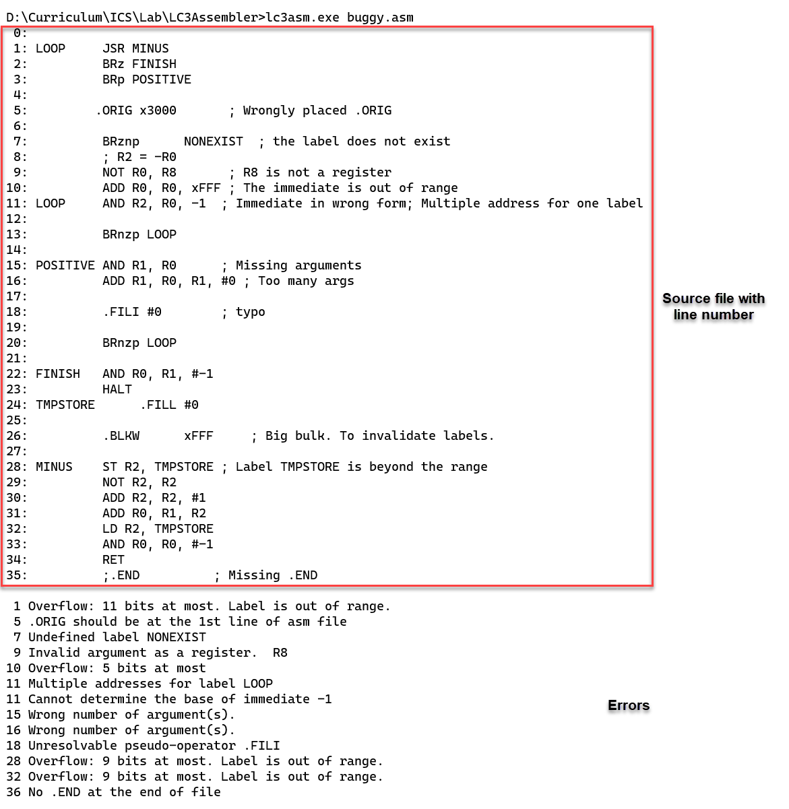
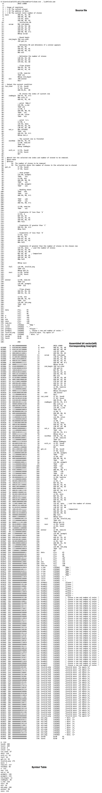
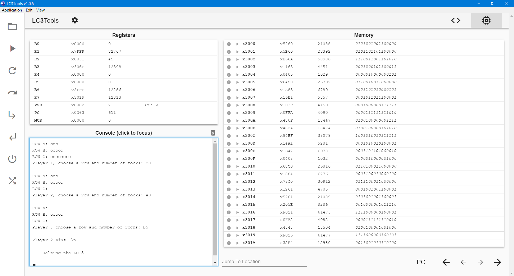

# LC-3 Assembler  Report

## Brief Introduction  

An LC-3 Assembler implemented with C++.  Converts `.asm` file to `.bin` file (but stored as `char`-type `0`s & `1`s) that can be opened with *LC-3 Simulator*.  

## Features  

* Shows the corresponding lines in `.asm` file of every 16-bit word.  
* Shows the address of every 16-bit word.  
* Shows the symbol table.  
* Show information of errors if the `.asm` file is wrongly written.  
  The assembler now supports the following kinds of errors:  
  1. The out-of-range label/offset.  
  2. The overflowed immediate.  
  3. Non-existed label.  
  4. Same-named label indicating multiple addresses.  
  5. Missing `.ORIG`/`.END`
  6. Wrongly placed `.ORIG`.  i.e. not at the first line.  
  7. Unexpected number of arguments.  
  8. Unresolvable symbols for registers/pseudo-instructions.  
  9. Incorrect prefix indicating base for immediate.  

## Core Algorithm  

* Organizes all the instructions with a map

  The core object of my assembler is called `InstructionFormatTable` as shown below:  
  ```cpp
  struct Arg {
    std::function<bit_vec(const std::string&)> arg_process;
    BitRange bitRange;
  };
  
  std::map<std::string, std::list<Arg>> InstructionFormatTable;
  ```
  
  The keys of `InstructionFormatTable` are the names of instructions, and the mapped values are lists of `Arg` objects.  
  
  Using `ADD` as an example.  
  `string("ADD")` will be one of the keys in this map, and `InstructionFormatTable["ADD"]` is a list of arguments belongs to `ADD`  (Here, we regard the string `"ADD"` is also one of the arguments).  That is, `list{Arg("ADD"), Arg_DesRegister, Arg_SrcRegister,   Arg_Register/Immediate}`.  
  
  Each `Arg` object includes 2 things:  
  1. A function to convert the string-type argument to machine language  
  2. The range of the arguments in the instruction.  
  
  Take `DesRegister` in `ADD` as an example, the function will be able to convert `"R1"` to `001`, and the range is from 9 to 11.  

  With this map constructed, when dealing with an instruction like `ADD R0, R1, R2`, we can simply take the 1st word(i.e. `ADD`) as the key, sequentially call the functions in `Arg` objects stored in `InstructionFormatTable["ADD"]` and assign the return value to a 16-bit bit vector according to the bit range.  

* Assemble with 2-Pass  
  1. 1st Pass  
     In the 1st pass, we divide the line into tokens, record the address of labels and store them, as well as the corresponding original line number.  
     One of the tricky problems is, if the 1st word starts with "BR", it may be operate `BR`, but can also be a label, depending on the following letters.  Additionally, the condition code following `BR` should be regarded as its arguments instead of part of the operate.  We set some exclusive `if`s to address these problems.  
  2. 2nd Pass  
     With each line converted to a list of tokens, we invoke the functions in `InstructionFormatTable` to each arguments and store the results as one bit vector, and output it along with the corresponding original line number.  

* Finds error with `exception` mechanism in C++  
  The finding-error system is basically implemented with `try-catch` statements.  
  When unexpected condition occurs, the function handling the conversion will throw the exception (such as `std::invalid_argument`, `std::out_of_range`) and the assembler catches it and store the error info with line number into `error_table`.  

## Project Organization  

The project consists of 2 parts:  

* class `Assembler` assembling the source file.  

  ```cpp
  // Only some of the members are shown.  
  class Assembler{
  private:
      std::map<std::string, std::size_t> symbolTable;
      // To store the label and corresponding line number(in .bin file).  

      std::map<std::string, std::list<Arg>> InstructionFormatTable;
      // See the 1st entry in "Core ALgorithm" for reference.  

      // Some functions handling the arguments(That may be part of a Arg object)
      static std::function<bit_vec(const std::string&)> str_to_opcode;
	  static std::function<bit_vec(const std::string&)> str_to_reg;
      static std::function<bit_vec(const std::string&, size_t, bool)> str_to_imm;
      static std::function<std::pair<bit_vec, bool>(const std::string&, size_t)> str_to_reg_or_imm;
      static std::function<bit_vec(const std::string&)> imm_reg_overload;
      std::function<bit_vec(const std::string&, size_t)> label_or_offset;// When dealing with label, the return value relies on the current file, so this object cannot be static
  public:
      Assembler(); // Initializes InstructionFormatTable.  This can be a tedious task.  

      std::map<std::string, std::size_t>& get_symbol_table();

      struct assembledInstruction
	  {
          bin_instruction instr; // A 16-bit bit vector
          size_t orig_line;      // The corresponding line number in `.asm` file
	  };

      /**
       * @brief To assemble the source file
       * @param first, last: Designate a range from which we can read lines of source file. Expects a string object after dereferencing InputIt.  
       * @param output: To where write the converted instructions
       * @return If assembled successfully
	   */
      template<typename InputIt, typename OutputIt>
	  bool assembly(InputIt first, InputIt last, OutputIt output);

  }
  ```

* function `main` dealing with the user interface.  

## Run  

   The 2 test files will be included in the `.zip` file.  

1. A peice of buggy code  
   I wrote a buggy program to show the finding-error feature of the assembler.  
   
2. Lab04: Nim's Game  
   A previous lab written by me.  
   

   Run on LC-3 simulator  

   

   *ps.  
   Know issue: I did not design mechanism handling escape characters like '\n' in value of .STRINGZ.  As you can see, the last line of the screenshot above is*
   > *Player 2 Wins. **\n***  

   *which is obviously not what we expected.*